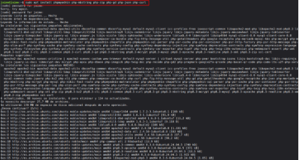
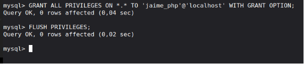
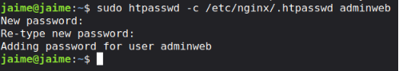
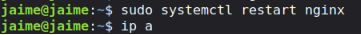
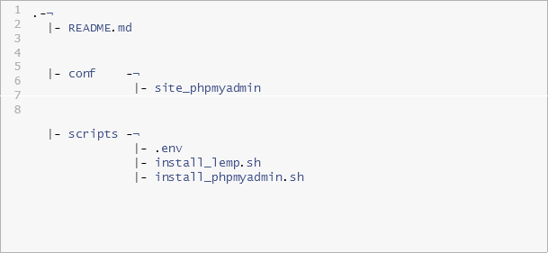

UD02 - Pràctica 04

Curs 2025-2026
![ref1]![ref2]

**Pràctica 4: phpmyadmin**

# **Objectiu**

- Instal·lar, assegurar i configurar phpMyAdmin en un servidor Ubuntu.
- Protegir PhpMyAdmin contra accessos no autoritzats.
- Automatitzar la instal·lació i configuració de phpMyAdmin mitjançant scripts de Bash.

# **Tasques a fer**

## **Instal·lació de PhpMyAdmin**
- Instal·la phpMyAdmin juntament amb les extensions PHP necessàries (php-mbstring, php-zip, php-gd, php-json, php-curl).

  

- Configura phpMyAdmin perquè funcione amb nginx.

  
##
##
## **Permetre l’Accés per Contrasenya del root de MySQL**
- Canvia el mètode d’autenticació de l’usuari root de MySQL d’auth\_socket a caching\_sha2\_password o mysql\_native\_password.

  

- Verifica els mètodes d’autenticació utilitzats per cadascun dels usuaris.

  

## **Configuració de l’Accés per Contrasenya per a un Usuari Dedicat de MySQL**
- Crea un nou usuari de MySQL amb una contrasenya segura.

  

- Dona-li al usuari els privilegis apropiats per gestionar les bases de dades a través de phpMyAdmin.

  

## **Assegura la Instància de phpMyAdmin**
- Crea un fitxer .htpasswd per emmagatzemar les credencials d’usuari i contrasenya.

  

- Modifica la configuració del lloc per aplicar l’accés per usuari i contrassenya.

  

- Reinicieu nginx per aplicar els canvis.

  

Assegureu-vos de seguir bones pràctiques de seguretat a cada pas. No inclogueu con- trasenyes reals a les captures de pantalla o al document. El document ha d’estar ben organitzat i fàcil de seguir.

## **Com Lliurar**
Hauràs de crear un repositori a GitHub amb el nom de la pràctica i la descripció de la mateixa. El repositori ha de tenir el contingut següent:

![ref3]

IAW - 2ASIX	[1/](#_bookmark0)

Una **documentació tècnica** al vostre repositori de Github, i publicat a Github Pages amb la descripció de tots els passos que s’han dut a terme.

- Els passos detallats que vas seguir per completar cadascun dels requisits.
- Instal·lació i configuració de phpMyAdmin.
- Configuració d’autenticació i mètodes d’autenticació de MySQL i Nginx.
- Els scripts de Bash que s’han utilitzat per automatitzar la instal·lació i configuració de PhpMyAd- min.
- Captures de pantalla demostratives dins de la documentació.

A més del contingut anterior pot ser necessari crear altres fitxers de configuració. A continuació es mostra un exemple de com pot ser lestructura del repositori:

1

2

3

4

5

6

7

8

.-¬

|- README.md

|- conf

-¬

|- site\_phpmyadmin

|- scripts -¬

|- .env

|- install\_lemp.sh

|- install\_phpmyadmin.sh
## **Scripts de Bash**
El directori scripts ha d’incloure els fitxers següents:

- **.env**: Aquest fitxer conté totes les variables de configuració que s’utilitzaran als scripts de Bash.
- **install\_lemp.sh**: Script de Bash amb l’automatització del procés d’instal·lació de la pila LEMP.
- **install\_phpmyadmin.sh**: Script de Bash amb l’automatització del procés de creació i configura- ció d’instal·lació i securització de phpMyAdmin.

# **Recursos**

- [Documentación de phpMyAdmin](https://www.phpmyadmin.net/docs/)
- [Documentación de MySQL](https://dev.mysql.com/doc/)
- [Documentación de NGINX](https://nginx.org/en/docs/)

![ref3]IAW - 2ASIX	[2/2](#_bookmark0)

[ref1]: Aspose.Words.3c225a72-eca6-4739-841e-ecdc5fa3400b.001.png
[ref2]: Aspose.Words.3c225a72-eca6-4739-841e-ecdc5fa3400b.002.png
[ref3]: Aspose.Words.3c225a72-eca6-4739-841e-ecdc5fa3400b.017.png
